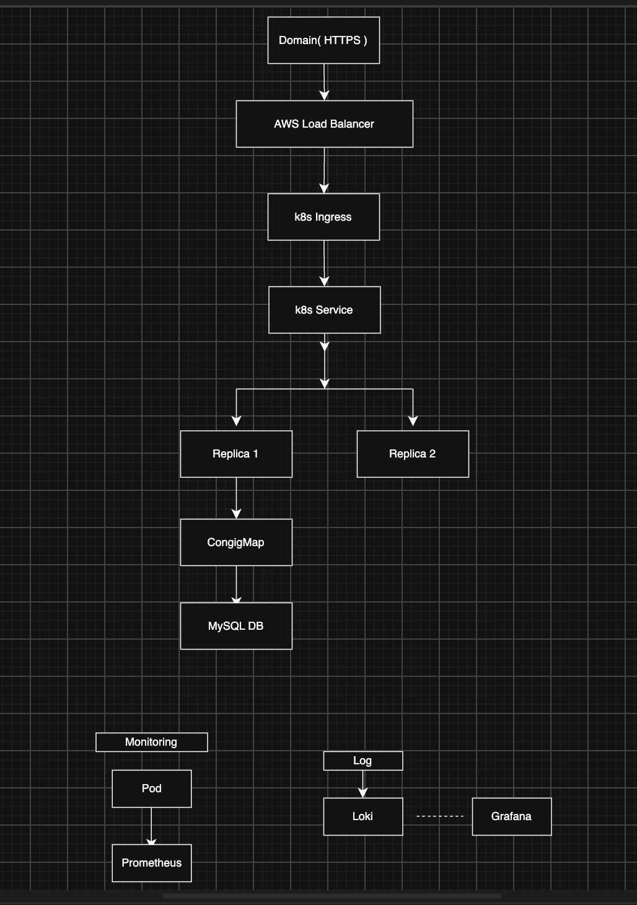

# howareyoujake

> 스포츠를 주제로, Kubernetes 기반 클라우드 환경에서 운영 가능한 커뮤니티 서비스를 구축한 개인 프로젝트입니다.


- 개발 기간: 2026-05-12 ~ 진행 중(보완 작업)
- 개발 인원: 1명
- Backend Repository: <https://github.com/dddf-1/community_crud>
- GitOps Repository: <https://github.com/dddf-1/community-gitops>

## 📌 프로젝트 소개

`howareyoujake`는 사용자가 스포츠를 주제로 게시글과 댓글을 공유하고, 좋아요와 검색으로 상호작용할 수 있는 커뮤니티 서비스의 백엔드입니다.

단순한 CRUD 구현에 그치지 않고 실제 서비스 운영 환경을 고려하여 다음 경험을 목표로 진행했습니다.

- JWT 기반 Stateless 인증·인가와 브라우저 쿠키 인증 연동
- 게시글 목록 조회를 위한 Offset/Cursor Pagination과 DTO Projection
- 조회수 증가 과정에서 발생하는 Lost Update 개선
- 회원·게시글 Soft Delete와 데이터 정합성 처리
- AWS 기반 인프라 및 Public/Private Network 설계
- Kubernetes와 GitOps 기반 배포 환경 구축
- Prometheus, Grafana, Loki 기반 Monitoring & Logging 구성

## 🚀 주요 기능

| 영역 | 구현 내용 |
| --- | --- |
| 인증 | 회원가입, 로그인, 로그아웃, 인증 상태 확인, JWT 발급·검증 |
| 회원 | 이메일·닉네임 중복 확인, 내 정보 조회·수정, 비밀번호 변경, 회원 탈퇴 |
| 게시글 | 작성·조회·수정·삭제, 이미지 첨부, 조회수, 페이지네이션, 검색 |
| 댓글 | 목록 조회, 작성, 수정, 삭제 및 작성자 권한 검증 |
| 좋아요 | 게시글 좋아요·취소, 중복 방지, 좋아요 수 집계 |
| 파일 | 프로필·게시글 이미지 업로드, 5MB 및 이미지 형식 제한 |
| 공통 | 입력값 검증, 일관된 오류 응답, CORS 설정, Health Check |

### 인증 방식

- `Authorization: Bearer <token>` 헤더와 `accessToken` 쿠키를 모두 지원합니다.
- 로그인 시 JWT를 `HttpOnly`, `SameSite` 쿠키로도 발급합니다.
- 비밀번호는 BCrypt로 암호화하며 서버 세션은 사용하지 않습니다.
- 탈퇴한 회원은 유효 기간이 남은 JWT를 보내더라도 다시 인증되지 않습니다.
- 인증 실패와 권한 부족은 각각 `401`, `403` JSON 응답으로 반환합니다.

### 게시글 조회

- 목록 응답은 작성자 정보, 댓글 수, 좋아요 수를 DTO Projection으로 한 번에 구성합니다.
- 기본 목록은 `page`와 `size`를 사용하는 `Slice` 기반 Pagination을 제공합니다.
- 대용량 목록 탐색을 위해 `lastCreatedAt`, `lastPostId` 기반 Cursor Pagination도 제공합니다.
- 제목과 본문 검색을 지원하며 `recent`, `relevance` 정렬을 선택할 수 있습니다.
- 상세 조회 시 현재 사용자의 좋아요 여부를 함께 반환합니다.

## 🛠 기술 스택

### Backend

- Java 17
- Spring Boot 4.0.6
- Spring Web MVC
- Spring Security
- Spring Data JPA
- QueryDSL 5.1
- Bean Validation
- MySQL, H2(Test)
- Gradle

### Infrastructure & Operations

- AWS Load Balancer, EC2, VPC
- Docker
- Kubernetes, Helm
- GitHub Actions, GitOps
- Prometheus, Grafana, Loki

## 🏗 아키텍처



```text
Client
  → Domain (HTTPS)
  → AWS Load Balancer
  → Kubernetes Ingress
  → Kubernetes Service
  → Spring Boot Pod
  → MySQL
```

애플리케이션 Pod는 복제본으로 운영하고, 모니터링 지표는 Prometheus와 Grafana에서 확인하며 로그는 Loki로 수집하도록 구성했습니다.

## ☸ Kubernetes 배포 구성

서비스 배포 환경은 Kubernetes와 Helm Chart 기반으로 구성했습니다. 배포 설정은 애플리케이션 저장소와 분리된 [GitOps Repository](https://github.com/dddf-1/community-gitops)에서 관리합니다.

- Helm Chart
- Deployment / Replica
- Service
- Ingress
- ConfigMap
- Monitoring & Logging

## 🔥 주요 개선 경험

### 1. N+1 Query 문제 개선

게시글 목록에서 Entity와 연관 관계를 그대로 순회하면 작성자, 댓글, 좋아요 데이터를 가져오는 추가 쿼리가 반복될 수 있었습니다.

**개선**

- 목록 전용 DTO Projection 적용
- 필요한 작성자 필드와 댓글·좋아요 집계값만 조회
- API 응답을 Entity와 분리

**결과**

- 불필요한 추가 Query 감소
- 목록 조회 성능 및 응답 구조 개선
- 영속성 계층 변경이 API에 직접 노출되는 문제 방지

### 2. 게시글 Pagination 및 Index 적용

게시글이 증가할수록 뒤쪽 페이지를 조회하는 Offset Pagination의 탐색 비용이 커질 수 있습니다.

**개선**

- Spring Data `Pageable`과 `Slice` 기반 목록 조회
- `(created_at, post_id)`를 커서로 사용하는 Cursor Pagination 추가
- 정렬 조건에 맞춘 복합 Index 적용

```sql
CREATE INDEX idx_posts_created_at_post_id
    ON posts (created_at DESC, post_id DESC);
```

Index 스크립트는 [`docs/sql/post-list-index.sql`](docs/sql/post-list-index.sql)에서 확인할 수 있습니다.

### 3. Lost Update 문제 개선

동시에 여러 조회 요청이 발생하면 각 요청이 동일한 조회수를 읽고 저장하면서 증가분이 유실될 수 있었습니다.

**개선**

- 기존의 `조회 → Java에서 증가 → 저장` 흐름 제거
- DB에서 `view_count = view_count + 1` 원자적 Update 수행
- 벌크 Update 후 영속성 Context를 초기화해 최신 조회수 반환
- 게시글 수정 충돌 감지를 위한 JPA `@Version` 적용

### 4. Soft Delete와 데이터 정합성

- 게시글과 회원에 `deleted_at`을 적용해 삭제 이력을 보존합니다.
- 삭제된 게시글은 목록, 검색, 상세 조회에서 제외합니다.
- 회원 탈퇴 시 작성 게시글을 비공개 처리하고 댓글·좋아요를 정리합니다.
- 탈퇴 회원의 이메일·닉네임을 대체하여 고유 제약을 유지하면서 재가입 가능성을 열어두었습니다.

### 5. 인증·파일 처리 보강

- 프런트엔드와 API 테스트 환경에서 공통으로 사용할 수 있도록 Header/Cookie JWT 인증을 지원합니다.
- DB 접속 정보, JWT Secret, CORS Origin, 쿠키, 업로드 경로를 환경변수로 분리했습니다.
- 업로드 파일은 5MB 이하의 JPG, PNG, GIF, WebP만 허용하고 UUID 파일명으로 저장합니다.
- 게시글과 회원 DTO에 Bean Validation을 적용하고 오류 응답을 통일했습니다.

## 📁 프로젝트 구조

```text
src/main/java/com/example/community
├── auth       # JWT 인증, 로그인·회원가입
├── member     # 회원 정보, 비밀번호, 탈퇴
├── post       # 게시글, 검색, Pagination
├── comment    # 댓글 CRUD
├── like       # 게시글 좋아요
└── global     # 공통 응답, 예외, Security/CORS, 파일 저장

src/test
├── java       # MockMvc 통합 테스트
├── groovy     # Application Context 테스트
└── resources  # H2 테스트 설정
```

## ⚙️ 로컬 실행

### 1. 요구 사항

- JDK 17
- MySQL

### 2. 데이터베이스 생성

```sql
CREATE DATABASE community
    CHARACTER SET utf8mb4
    COLLATE utf8mb4_unicode_ci;
```

### 3. 환경변수 설정

```bash
export JWT_SECRET="32-byte-or-longer-random-secret-value"
export DB_URL="jdbc:mysql://localhost:3306/community?serverTimezone=Asia/Seoul&characterEncoding=UTF-8"
export DB_USERNAME="root"
export DB_PASSWORD="your-mysql-password"
export CORS_ALLOWED_ORIGINS="http://localhost:8082"
```

### 4. 애플리케이션 실행

```bash
./gradlew bootRun
```

서버 기동 후 `GET http://localhost:8080/health`가 `200 OK`와 `OK`를 반환하면 정상입니다.

### 주요 환경변수

| 변수 | 기본값 | 설명 |
| --- | --- | --- |
| `JWT_SECRET` | 없음(필수) | HS256 서명 키, 32바이트 이상 |
| `JWT_EXPIRATION_MILLIS` | `3600000` | Access Token 유효 시간 |
| `DB_URL` | 로컬 `community` DB | MySQL JDBC URL |
| `DB_USERNAME` | `root` | DB 사용자 |
| `DB_PASSWORD` | 빈 값 | DB 비밀번호 |
| `DDL_AUTO` | `update` | Hibernate DDL 정책 |
| `JPA_SHOW_SQL` | `false` | SQL 출력 여부 |
| `CORS_ALLOWED_ORIGINS` | `http://localhost:8082` | 허용할 Origin, 쉼표로 복수 지정 |
| `COOKIE_SECURE` | `false` | HTTPS 운영 환경에서는 `true` 권장 |
| `COOKIE_SAME_SITE` | `Strict` | 인증 쿠키 SameSite 정책 |
| `UPLOAD_DIR` | `./uploads` | 이미지 저장 경로 |

> 운영 환경에서는 `DDL_AUTO=validate`, `COOKIE_SECURE=true`를 사용하고 DB 변경은 명시적인 Migration으로 관리하는 것을 권장합니다.

## 🧪 테스트

```bash
SPRING_PROFILES_ACTIVE=test ./gradlew clean test bootJar --no-daemon
```

H2와 MockMvc를 사용해 다음 흐름을 자동 검증합니다.

```text
회원가입 → 쿠키 로그인 → 인증 확인 → 게시글 작성
→ 댓글 작성 → 좋아요 → 상세 집계 → 검색 → Soft Delete
```

인증 쿠키가 없는 보호 API 요청이 `401 Unauthorized`를 반환하는지도 함께 검증합니다.

## 📝 트러블슈팅

### DNS Cache 문제

Ingress/NLB 변경 이후 일부 환경에서 요청이 이전 IP로 향하는 문제가 발생했습니다.

- 원인: Local DNS Resolver Cache
- 해결: DNS Cache 초기화 후 새 Load Balancer 주소로 정상 접근 확인

### JWT 인증 방식 불일치

API 테스트 도구는 Authorization Header를 사용하고 프런트엔드는 Cookie를 포함해 요청하면서 인증 흐름이 달라지는 문제가 있었습니다.

- `Authorization: Bearer <token>` 지원
- `HttpOnly` Cookie 기반 Token 지원
- 로그인·로그아웃 시 쿠키 발급과 삭제 처리

## 📌 후기

기존에는 백엔드와 프런트엔드 코드 구현을 중심으로 프로젝트를 진행했지만, 이번 프로젝트에서는 실제 운영 환경에 배포하고 그 과정에서 발생하는 문제까지 고려하고 해결할 수 있었습니다.

특히 AWS와 Kubernetes 기반 서비스 운영 구조를 직접 구성하면서 애플리케이션뿐 아니라 네트워크, 배포, 모니터링, 로그 수집이 하나의 서비스로 연결되는 과정을 이해할 수 있었다는 점에서 많이 배웠습니다.
